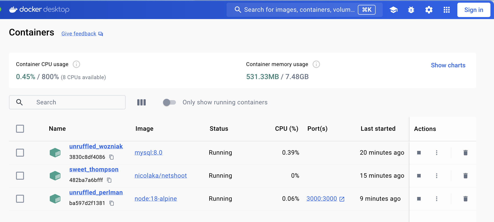

# Docker `getting-started` Tutorial notes

This repository is a sample application for users following the getting started guide at https://docs.docker.com/get-started/02_our_app/.

# Overview of tutorial:

-   Learn how to
    -   build an `image` (versions, like git commits),
    -   create/start/stop a `container` (like live servers),
    -   create `volumes` (database)
    -   create/pause/remove a `network` with several containers
-   Understand the difference between
    -   `volume mount` (lets you keep database between rebuilds)
    -   vs `bind mount` (allows quick code changes with nodemon, not needing a rebuild)
-   Write a
    -   `Dockerfile` (instructions how 1 container should be built. Includes caching image layers for faster rebuilds)
    -   `compose.yml` file (how multiple containers with their Dockerfiles should be put together. E.g. which localhost mapping and db connection variables)
    -   `.dockerignore` file for faster Dockerfile image rebuilds
-   For the database, the tutorial
    -   first uses `SQLite`,
    -   then `MySQL` for multi-container apps

# 0. Getting Started

-   Clone or fork the repository:

```bash
$ git clone https://github.com/docker/getting-started-app.git
```

-   In your terminal, cd into this new repository

# 1. Build the app **image**

-   `cd` into the project
-   Create Dockerfile:

    ```bash
    $ touch Dockerfile
    ```

-   Add to Dockerfile:

    ```Dockerfile
    # syntax=docker/dockerfile:1

    FROM node:18-alpine # download all required layers
    WORKDIR /app
    COPY . .
    RUN yarn install --production # install project dependencies
    CMD ["node", "src/index.js"] # Default command to run when starting a container from this image
    EXPOSE 3000
    ```

-   Build the image

```bash
    $ docker build -t getting-started .
```

-   Docker needs to download all required layers (e.g. node:18-alpine version if it's not on my machine yet)
-   `-t getting-started` flag tags the image → can now call it by `getting-started` when I run a container
-   `.` → location of the Dockerfile

# 2. Start/Run an app **container**

```bash
$ docker run -dp 127.0.0.1:3000:3000 getting-started
```

-   `-d`: detach. Runs container in the background
-   `-p HOST:CONTAINER`: publish on port. E.g. map container's `3000` to `localhost:3000` (aka `127.0.0.1:3000`)

-   Use todo app in browser under `localhost:3000`

# 3. List Docker containers

1. CLI:

```bash
$ docker ps
```

| CONTAINER ID | IMAGE           | COMMAND                | CREATED       | STATUS       | PORTS                    | NAMES                |
| ------------ | --------------- | ---------------------- | ------------- | ------------ | ------------------------ | -------------------- |
| df784548666d | getting-started | "docker-entrypoint.s…" | 2 minutes ago | Up 2 minutes | 127.0.0.1:3000->3000/tcp | priceless_mcclintock |

1. Docker Desktop app: in `Containers` tab

# 4. Update the app (image & container)

1. Edit something in the source code
1. Re-build the **image**:

```bash
  $ docker build -t getting-started .
```

1. Remove the **old container**:

```bash
  $ docker ps # gets you the container ID

  # a. Stop & remove container long:
  $ docker stop <the-container-id>
  $ docker rm <the-container-id>

  # b. Stop & remove container short:
  $ docker rm -f <the-container-id> # force

  # c. Click delete icon in the desktop-app
```

1. Start a **new container**:

```bash
  $ docker run -dp 127.0.0.1:3000:3000 getting-started
```

These are available container features:

```bash
$ docker container run [OPTIONS] IMAGE [COMMAND] [ARG...] # same as docker run, creates new container
$ docker container start some-container # Play button in App
$ docker container stop some-container # Stop button in App
$ docker container rm -f some-container # Trash button in App
$ docker container exec some-container # access & do sth in the container. Add -it for interactive session. Can add command like sh -c "echo a && echo b"
$ docker container logs -f some-container # read logs, follow
$ docker container ls # same as docker ps
```

In the desktop app they look like this:


# 5. Volume mount to persist data between rebuilds

-   Each container: uses filesystem from image-layers. Also has some scratch space to save data.

    -   Look at this filesystem in Desktop App: click on container -> Files tab -> /app has code, /etc has temporary db
    -   This data is isolated inside the container
    -   _BUT_ building new image & container will loose that data

-   Use **Volumes** to persist data between image/container rebuilds
    -   Connects the container's filesystem paths & host machine (managed by Docker, incl the disk storage location)
    -   Types of volumes: **volume mount** & **bind mount**
    -   How persist: Create a volume, attach (mount) it to storage directory (on host), make the container write to it

```bash
  # Create volume:
  $ docker volume create todo-db

  # Start container, and mount a volume named like above:
  $ docker run -dp 127.0.0.1:3000:3000 --mount type=volume,src=todo-db,target=/etc/todos getting-started

  #
  $ docker volume inspect todo-db
```

In the desktop app, you can few the container's file system here:


# 6. Bind mount for quick local development without rebuild

-   Share host filesystem directory into container
-   Container immediately sees code changes (like what nodemon is to node)
-   Especially useful for local development

## Create

```bash
  # Create new bind container:
  $ cd into project
  $ docker run -it --mount type=bind,src="$(pwd)",target=/src ubuntu bash
  # instruction is: put pwd in container/src


  # Automatically starts interactive session in terminal (you can also see that in Desktop app Logs)
  root@thiscontainerid:/# pwd
  /
  root@ac1237fad8db:/# ls
  bin dev home media src etc ...

  # cd into src and create new file:
  root@ac1237fad8db:/# cd src

  root@ac1237fad8db:/src# ls
  Dockerfile  node_modules  package.json  spec  src  yarn.lock

  root@ac1237fad8db:/src# touch myfile.txt

  root@ac1237fad8db:/src# ls
  Dockerfile  myfile.txt  node_modules  package.json  spec  src  yarn.lock

  # You can now see the new file in VSCode, and Docker-app/container/Files/src
  # Even this Readme change is updating in Docker-app!

  Ctrl + D # stops interactive session
```

## Local development example

-   quickly view code changes without rebuild
-   `-w /app` sets working directory
-   node public image, previous example used ubuntu image
-   `sh` instead of bash
-   `yarn run dev` -> package.json dev command uses nodemon here

```bash
# Create:
$ docker run -dp 127.0.0.1:3000:3000 \
    -w /app --mount type=bind,src="$(pwd)",target=/app \
    node:18-alpine \
    sh -c "yarn install && yarn run dev"

# Watch logs:
$ docker logs -f <container-id>
Ctrl + C

# Edit app & view results in browser

# When happy with edits, rebuild (if you do the old docker run command, it won't be doing nodemon then any more):
$ docker build -t getting-started .
```

# 7. Multi-container apps: add MySQL database

## Why

-   The database should be in its own container (not together with API): allows independent hosting/deployment, scaling, versioning...
-   1 container = 1 process. But multiple processes are more complex!

## How

-   Let the containers talk to each other via network

1. Create a network for all the next containers:

```bash
 # Create network:
  $  docker network create todo-app
```

2. Start up a MySQL container

```bash
  # Start MySQL container (automatically create a volume too) with env vars & add to network:
  $ docker run -d \
    --network todo-app --network-alias mysql \
    -v todo-mysql-data:/var/lib/mysql \
    -e MYSQL_ROOT_PASSWORD=secret \
    -e MYSQL_DATABASE=todos \
    mysql:8.0

  # Connect do db interactively:
  $ docker exec -it <mysql-container-id> mysql -u root -p

    # enter password
  mysql> SHOW DATABASES
  mysql> exit

```

3. Start nicolaka/netshoot container (useful [tool](https://github.com/nicolaka/netshoot) for network things)

```bash
  $ docker run -it --network todo-app nicolaka/netshoot
  nicolata-container-id> dig mysql

    ;; Answer SECTION:
    mysql .    600 IN A   172.23.0.2 # this is the mysql IP address

  nicolata-container-id> exit # to quit session. Also stops container
```

4. Start the app-container with correct MySQL connection:

-   Give network name
-   Give same env variables as MySQL to connect to that container in this network

```bash
  $ docker run -dp 127.0.0.1:3000:3000 \
  -w /app -v "$(pwd):/app" \
  --network todo-app \
  -e MYSQL_HOST=mysql \
  -e MYSQL_USER=root \
  -e MYSQL_PASSWORD=secret \
  -e MYSQL_DB=todos \
  node:18-alpine \
  sh -c "yarn install && yarn run dev"
```

5. Try it out

-   Add items in localhost:3000
-   Check db in terminal (connect to mysql container):

```bash
$ docker exec -it <mysql-container-id> mysql -p todos

mysql> select * from todo_items;
mysql> exit
```

In the app, the containers will look like this:


# 8. Docker compose.yml to define multi-container environment

# What

-   Put the commands from the previous step into one file
-   Makes a quicker clone & start for any collaborator (because much fewer things need to be typed into the terminal)

# How

0.  cd into this project root
1.  create `compose.yaml` file

```yml
services:
    # 1. Define the app service
    app: # automatic alias
        image: node:18-alpine # same as Dockerfile
        command: sh -c "yarn install && yarn run dev" # from package.json
        ports:
            - 127.0.0.1:3000:3000 # map localhost:3000 to Dockerfile port
        working_dir: /app
        volumes:
            - ./:/app
        environment: # env vars
            MYSQL_HOST: mysql # same name as service 2
            MYSQL_DB: todos # same name as MYSQL_DATABASE
            MYSQL_USER: root
            MYSQL_PASSWORD: secret # same password as MY_SQL_ROOT_PASSWORD

    # 2. Define the MySQL database as service
    mysql: # automatic alias
        image: mysql:8.0
        volumes:
            - todo-mysql-data:/var/lib/mysql # define mount point
        environment: # env vars
            MYSQL_DATABASE: todos
            MYSQL_ROOT_PASSWORD: secret

volumes:
    todo-mysql-data: # create the volume
```

2. Run the application stack

-   stop & remove old running containers (either `$ docker container rm -f <container-id-app> <container-id-mysql>` OR in Desktop App select all -> stop -> delete)

-   `$ docker compose up -d`

    -   Behind the scenes: Docker Compose creates a network, the volume and containers(services) defined

-   `$ docker compose logs -f` logs all services into 1 stream (can show any time-related problems)

    ```bash
        2024-02-15 16:03:32 2024-02-15T16:03:32.732455Z 0 [System] [MY-010931] [Server] /usr/sbin/mysqld: ready for connections. Version: '8.0.36'  socket: '/var/run/mysqld/mysqld.sock'  port: 0  MySQL Community Server - GPL.
        app_1    | Connected to mysql db at host mysql
        app_1    | Listening on port 3000
    ```

-   Check Desktop app that all containers are running
-   Visit localhost:3000 in browser
-   Then can do db queries: go to Docker Desktop app -> click on my-sql container -> Exec tab

```bash
  mysql -u root todos -p
  mysql> select * from todo_items;
```

-   When finished

```bash
  # Stop for the day:
  $ docker compose stop # stops all containers. (Or in app: stop button). Next day: $ docker compose start

  # OR delete whole network:
  $ docker compose down # stops & removes containers & network. (Or in app: trash can)
```

It looks like this:


Running containers:


DB queries inside Desktop app:


# 9. Image building best practices

## Dockerfile & .dockerignore: Cache image layers

    -   Each line in the Dockerfile = 1 layer
    -   When image rebuilds -> downloads dependencies again, which is unnecessary.
    -   Instead, want to cache these dependencies, so rebuilding is faster:
    1. In the Dockerfile: split COPY into 2:
    ```Dockerfile
      # syntax=docker/dockerfile:1
      FROM node:18-alpine
      WORKDIR /app
      COPY package.json yarn.lock ./
      RUN yarn install --production
      COPY . .
      CMD ["node", "src/index.js"]
      EXPOSE 3000
    ```
    2. In .dockerignore file at the same level as the Dockerfile, add `node_modules`:
    ```
      node_modules
    ```

## Build in multi-stages

-   Smaller image size (only load what you need).
-   Dependencies split: build-time vs runtime
-   React example:

```Dockerfile
  # syntax=docker/dockerfile:1
  FROM node:18 AS build
  WORKDIR /app
  COPY package* yarn.lock ./
  RUN yarn install
  COPY public ./public
  COPY src ./src
  RUN yarn run build

  FROM nginx:alpine
  COPY --from=build /app/build /usr/share/nginx/html # copies build into nginx container
```
